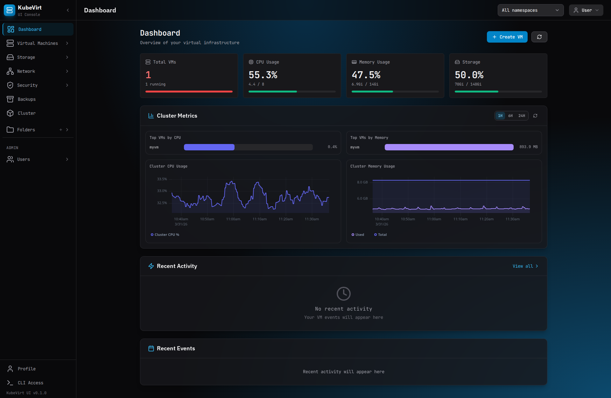
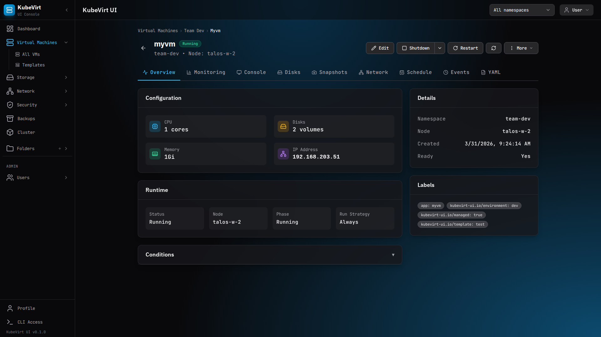
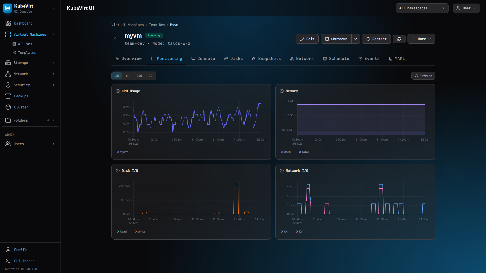
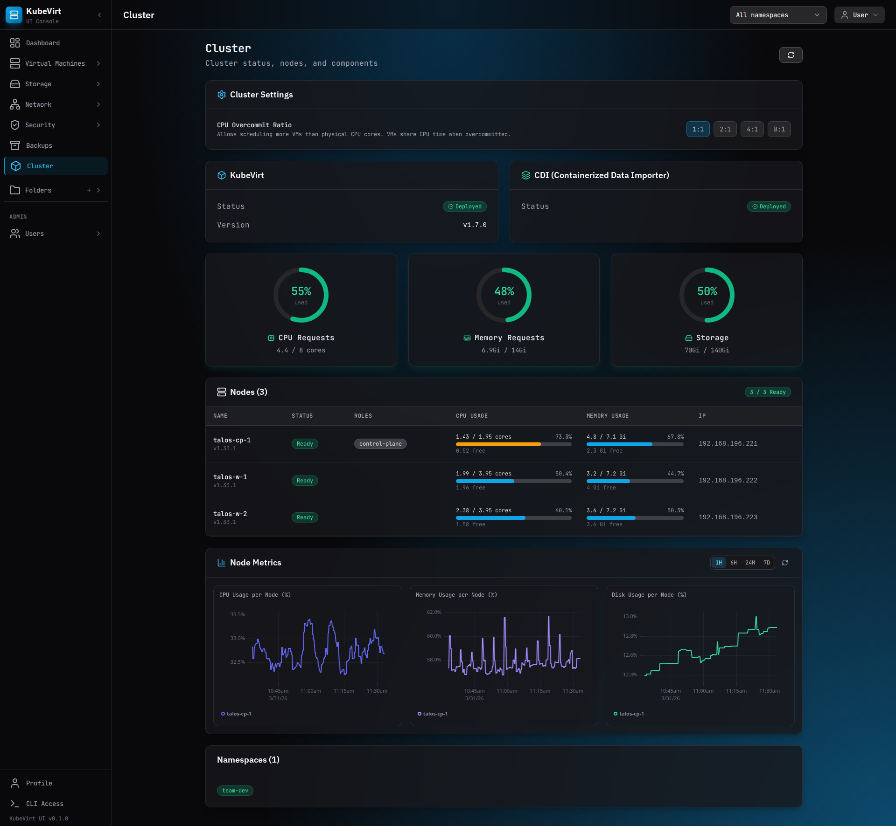
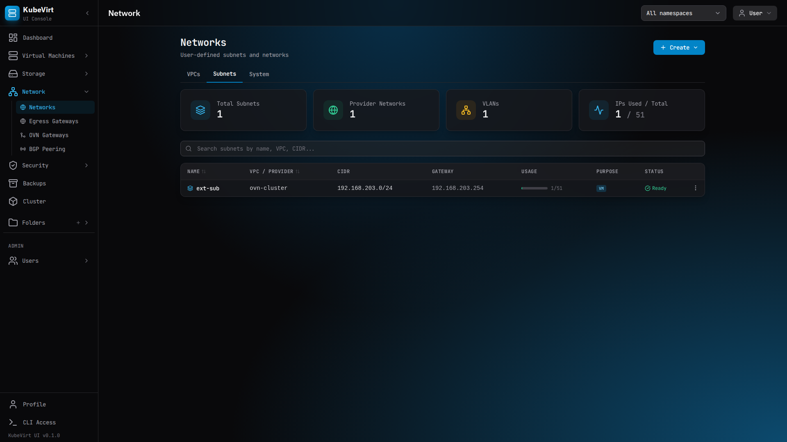
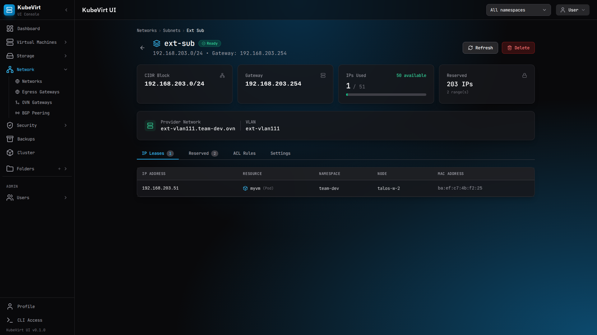

# KubeVirt UI

A lightweight, Kubernetes-native web interface for managing virtual machines with KubeVirt.


## Overview

KubeVirt UI provides a simple, intuitive web interface for managing virtual machines in KubeVirt environments. It focuses on simplicity and minimal clicks while maintaining full power for advanced users.

### Key Features

- 🖥️ **VM Management** — Create, start, stop, restart, migrate VMs
- 💾 **Storage** — Manage DataVolumes, PVCs, snapshots
- 🌐 **Network** — Configure VM networks, view policies
- 🔐 **RBAC** — Kubernetes-native access control
- 📝 **YAML Editor** — Full control for power users
- 🖱️ **Consoles** — VNC and serial console access

### Design Principles

- **Kubernetes as Single Source of Truth** — No external databases
- **Stateless Backend** — All state lives in Kubernetes
- **Security by Default** — RBAC, minimal privileges
- **Air-gap Ready** — Works in isolated environments
- **GitOps Friendly** — Works with existing resources

## Screenshots



| VM Detail | Monitoring | Cluster |
|:---------:|:----------:|:-------:|
|  |  |  |

| Network | Subnet Detail |
|:-------:|:-------------:|
|  |  |

## Quick Start

### Prerequisites

- Docker
- Make

### Development

```bash
# Start development environment (Docker required)
make dev

# Access:
#   UI       → http://localhost:3333
#   API      → http://localhost:8888
#   LLDAP UI → http://localhost:17170 (admin / admin_password)
#   Dex      → http://localhost:5556
```

### Production Deployment

```bash
# Install via Helm
helm install kubevirt-ui ./helm/kubevirt-ui -n kubevirt-ui --create-namespace

# Or with custom values
helm install kubevirt-ui ./helm/kubevirt-ui -n kubevirt-ui --create-namespace -f my-values.yaml
```

See [docs/deployment.md](docs/deployment.md) for detailed deployment scenarios and [helm/kubevirt-ui/README.md](helm/kubevirt-ui/README.md) for all Helm chart parameters.

## Architecture

```
┌─────────────────┐     ┌─────────────────┐     ┌─────────────────┐
│    Frontend     │────▶│     Backend     │────▶│  Kubernetes API │
│  React + Vite   │     │ Python + FastAPI│     │    KubeVirt     │
└─────────────────┘     └─────────────────┘     └─────────────────┘
```

See [docs/ARCHITECTURE.md](docs/ARCHITECTURE.md) for detailed architecture.

## Project Structure

```
kubevirt-ui/
├── backend/                 # Python FastAPI backend
│   ├── app/
│   │   ├── api/            # REST API endpoints
│   │   ├── core/           # K8s client, auth, RBAC
│   │   ├── models/         # Pydantic models
│   │   └── services/       # Business logic
│   ├── tests/
│   ├── Dockerfile
│   └── requirements.txt
├── frontend/               # React TypeScript frontend
│   ├── src/
│   │   ├── api/           # API client
│   │   ├── components/    # React components
│   │   ├── pages/         # Page components
│   │   └── hooks/         # Custom hooks
│   ├── Dockerfile
│   └── package.json
├── helm/                   # Helm chart
│   └── kubevirt-ui/
├── docs/                   # Documentation
│   ├── ARCHITECTURE.md     # Detailed architecture
│   ├── authentication.md   # OIDC auth & LLDAP guide
│   ├── deployment.md       # Production deployment guide
│   ├── websocket-api.md    # WebSocket API reference
│   └── RESOURCE_MAPPING.md # K8s resource → API mapping
├── docker-compose.yml      # Dev environment
├── Makefile               # Build commands
└── README.md
```

## Development

### Available Commands

```bash
# Development
make dev              # Start full dev environment (lldap + dex + backend + frontend)
make dev-backend      # Start backend only
make dev-frontend     # Start frontend only
make logs             # Tail all container logs
make stop             # Stop all containers
make restart          # Restart all containers

# Testing
make test             # Run all tests
make test-backend     # Run backend tests (pytest)
make test-frontend    # Run frontend tests (vitest)
make test-e2e         # Run end-to-end tests

# Building
make build            # Build all production Docker images
make build-backend    # Build backend image
make build-frontend   # Build frontend image

# Code quality
make lint             # Run all linters (ruff + eslint)
make format           # Auto-format all code (ruff + prettier)

# Helm
make helm-lint        # Lint Helm chart
make helm-template    # Render Helm templates
make helm-package     # Package Helm chart to dist/
```

### Backend Development

```bash
cd backend
python -m venv venv
source venv/bin/activate
pip install -r requirements.txt -r requirements-dev.txt
uvicorn app.main:app --reload --host 0.0.0.0 --port 8000
```

### Frontend Development

```bash
cd frontend
npm install
npm run dev
```

## Configuration

### Environment Variables

See [.env.example](.env.example) for a complete list with comments.

#### Backend

| Variable | Description | Default |
|----------|-------------|---------|
| `KUBECONFIG` | Path to kubeconfig file | `None` (uses in-cluster config) |
| `K8S_IN_CLUSTER` | Use in-cluster ServiceAccount auth | `false` |
| `LOG_LEVEL` | Logging level (`DEBUG`, `INFO`, `WARNING`, `ERROR`, `CRITICAL`) | `INFO` |
| `CORS_ORIGINS` | Allowed CORS origins (comma-separated) | `""` (no CORS) |
| `AUTH_TYPE` | Authentication mode: `none`, `oidc`, `token` | `none` |
| `OIDC_ISSUER` | OIDC issuer URL (must be reachable from browser) | `""` |
| `OIDC_INTERNAL_URL` | Internal OIDC issuer URL (backend-to-IdP, falls back to `OIDC_ISSUER`) | `""` |
| `OIDC_CLIENT_ID` | OIDC client ID | `kubevirt-ui` |
| `OIDC_CLIENT_SECRET` | OIDC client secret | `""` |
| `LLDAP_ENABLED` | Enable bundled LLDAP user management | `false` |
| `LLDAP_URL` | LLDAP web API URL | `http://lldap:17170` |
| `LLDAP_ADMIN_USER` | LLDAP admin username | `admin` |
| `LLDAP_ADMIN_PASSWORD` | LLDAP admin password | `admin_password` |
| `LLDAP_LDAP_BASE_DN` | LDAP base DN | `dc=kubevirt,dc=local` |
| `LLDAP_LDAP_HOST` | LLDAP LDAP protocol host | `lldap` |
| `LLDAP_LDAP_PORT` | LLDAP LDAP protocol port | `3890` |
| `METRICS_DIRECT` | Force metrics mode: `true`/`false`/empty (auto) | `""` |
| `METRICS_SERVICE` | Override metrics service (`namespace/service:port`) | `""` |
| `K8S_OIDC_ENABLED` | Enable OIDC kubeconfig variants (requires K8s API OIDC config) | `false` |
| `ENABLE_TENANTS` | Enable multi-tenant mode | `false` |

#### Frontend (Vite build-time)

| Variable | Description | Default |
|----------|-------------|---------|
| `VITE_API_URL` | Backend API URL (dev server only) | — |
| `VITE_DEX_ISSUER` | OIDC issuer URL for login redirects | — |
| `VITE_OIDC_CLIENT_ID` | OIDC client ID | `kubevirt-ui` |

### Feature Flags

| Flag | Environment Variable | Helm Value | Description |
|------|---------------------|------------|-------------|
| **Multi-tenant mode** | `ENABLE_TENANTS=true` | `backend.env.ENABLE_TENANTS` | Enables project/namespace isolation with tenant-aware RBAC. Each tenant gets a dedicated namespace with resource quotas. |
| **VNC Console** | — | `config.features.enableVNCConsole` | Show/hide VNC console button in VM detail view. Requires KubeVirt VNC subresource support. |
| **Serial Console** | — | `config.features.enableSerialConsole` | Show/hide serial console button. Requires KubeVirt console subresource support. |
| **Live Migration** | — | `config.features.enableLiveMigration` | Show/hide live migration controls. Requires KubeVirt live migration feature gate. |
| **Snapshots** | — | `config.features.enableSnapshots` | Show/hide VM snapshot controls. Requires VolumeSnapshot CRDs and CSI driver support. |

### Helm Values

See [helm/kubevirt-ui/README.md](helm/kubevirt-ui/README.md) for all Helm chart parameters, or [helm/kubevirt-ui/values.yaml](helm/kubevirt-ui/values.yaml) for the raw values file.

## API Documentation

API documentation is available at `/api/docs` (Swagger UI) and `/api/redoc` (ReDoc).

### Key Endpoints

- `GET /api/v1/namespaces/{ns}/vms` — List VMs
- `POST /api/v1/namespaces/{ns}/vms` — Create VM
- `POST /api/v1/namespaces/{ns}/vms/{name}/start` — Start VM
- `WS /api/v1/watch/vms` — Watch VM changes

See [docs/RESOURCE_MAPPING.md](docs/RESOURCE_MAPPING.md) for full API mapping.

## Documentation

| Document | Description |
|----------|-------------|
| [Architecture](docs/ARCHITECTURE.md) | System architecture, component interaction, data flow |
| [Deployment Guide](docs/deployment.md) | Production deployment with Helm, auth scenarios, RBAC |
| [Authentication](docs/authentication.md) | OIDC setup, Dex + LLDAP, token auth |
| [WebSocket API](docs/websocket-api.md) | VNC and serial console WebSocket protocol |
| [Resource Mapping](docs/RESOURCE_MAPPING.md) | Kubernetes resources to API endpoints mapping |
| [Helm Chart](helm/kubevirt-ui/README.md) | Full Helm chart parameters reference |
| [.env.example](.env.example) | All environment variables with comments |

## Contributing

1. Fork the repository
2. Create a feature branch (`git checkout -b feature/amazing-feature`)
3. Commit your changes (`git commit -m 'Add amazing feature'`)
4. Push to the branch (`git push origin feature/amazing-feature`)
5. Open a Pull Request

## License

Apache License 2.0 - see [LICENSE](LICENSE) for details.

## Acknowledgments

- [KubeVirt](https://kubevirt.io/) — VM virtualization on Kubernetes
- [FastAPI](https://fastapi.tiangolo.com/) — Backend framework
- [React](https://react.dev/) — Frontend library
